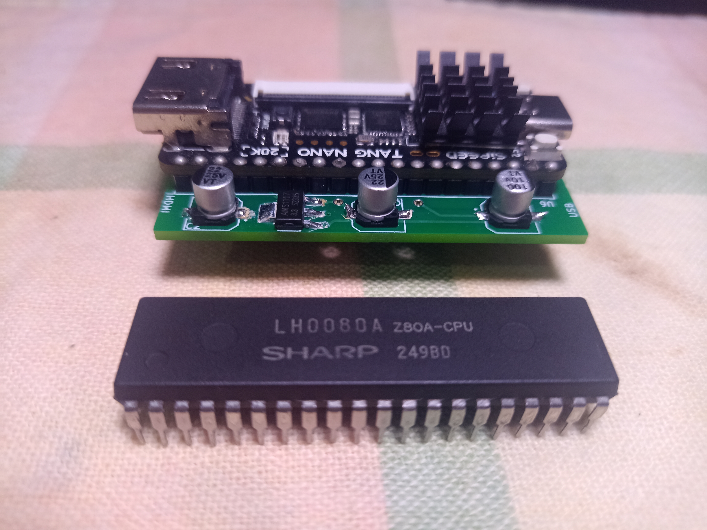

# Revision 4 Prototype

Although Fourth Revision is a prototype, it works with both MSX Hotbit (with 512KB mapper) and MSX Expert. The third revision has not been pulled because it didn't work.

## BOM

Check our [Interactive BOM](https://html-preview.github.io/?url=https://raw.githubusercontent.com/jabadiagm/MSXgoauld_tn20k/main/kicad/v4/ibom.html) to have better details.

| Reference | Chip | Value |
|:-----:|:-----:|:-----:|
| U1~U2 | 74HCT373 (TSSOP-20) | - |
| U3~U4 | 74LVT245 (TSSOP-20) | - |
| U5 | 74LVC245 (TSSOP-20) | - |
| U6 | Tang Nano 20k | - |
| U7 * | AMS1117-3.3 (SOT-223) | - |
| D1* | 1N5817 (THT) | - |
| D2* | DSS32 (SOD123FL) | - |
| C1 | 16V SMD Capacitor | $\mathsf{100\ \mu F}$ |
| C2~C3 ** | 16V SMD Capacitor | $\mathsf{22\ \mu F}$ |
| R1 | Resistor (0603) | $\mathsf{10\ k\Omega}$ |

\* Choose D1 or D2 to use if you want voltage protection over HDMI. You can also choose not to use them by placing a jumper, but make sure to power MSX before connecting Goa'uld to an HDMI monitor.

\*\* These are also optional if you want to use Tang Nano 20k internal voltage regulator. If so, make sure to close J3 and J4 Jumpers.

## Jumper Setup

The recommended jumper configuration set is with 3.3V voltage regulator setup:

|Jumper | State |
|:-----:|:-----:|
| J1 | Z80 Header |
| J2 | Closed (solder) |
| J3 | Open |
| J4 | Open |

If you want to use with internal Tang Nano 20K regulator:

|Jumper | State |
|:-----:|:-----:|
| J1 | Z80 Header |
| J2 | Closed (solder) |
| J3 | Closed (solder) |
| J4 | Closed (solder) |
